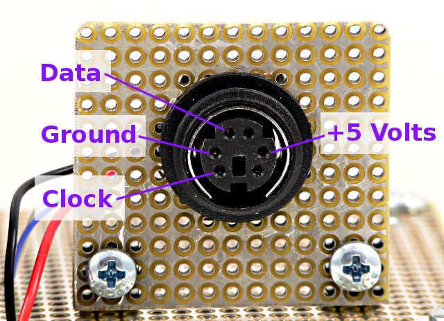

   

# Description

This Raspberry Pi Pico W C SDK  project converts a PS/2 keyboard to either a BLE or a USB keyboard.   It uses a PIO state machine to read the PS/2 stream.

 For development I used:
* Raspberry Pi Pico W
* Microsoft Natural Keyboard Elite keyboard (KU-0045, "white speedbump")

 For testing:
* Checked BLE bridge function with an Android phone
* Checked USB bridge function with a Linux laptop.

#  Build 

Built with [Raspberry Pi Pico C SDK 2.2.1](https://github.com/raspberrypi/pico-sdk).  It may work with other versions of the SDK 

Standard cmdline CMake build using the Pico C SDK. (i.e. mkdir build; cd build; cmake ..; make)
 Export PICO_SDK_PATH environment variable to point to your SDK.

I used [this Docker image](https://github.com/lukstep/raspberry-pi-pico-docker-sdk)
to make a container.  It contains an old version of the C SDK: I manually installed the current/newer version.

## Configuring the Build

 Edit the top level CMakeLists.txt file: 
* Choose between code for a BLE or USB keyboard bridge by setting the DEVICE_TYPE variable

**TBD  
Also need to be able to move the PS/2 DATA and CLK pins  
Move NO_PS2_WRITES in ps2kbd-lib to top CMakeLists.txt also**

## First time Build 
($ is the top level of your repository clone)

    cd $
    mkdir build
    cd build
    cmake ..
    make

Any time you change the configuration in the CMakeLists.txt, you should rm -rf the build directory, then rerun the cmake .. and make

#  Connections

 I built a simple adapter board to connect my PS/2 keyboard to the Pico W

| PS/2 &nbsp; &nbsp; &nbsp; &nbsp; &nbsp; &nbsp; | PICO W Pin &nbsp; &nbsp; &nbsp; | Pico Signal |
| :----------- | :---------- | :-------|
| Data | 19 | GPIO14 |
| CLK  | 20 | GPIO15 |
| 5V   | 40 | VBUS   |
| GND  | 18 | GND, many other choices | 

 I ran my keyboard off the 5V VBUS output from the Pico W, which is powered by the USB port.   It could
be more robust to use an external 5V supply to run the Pico and keyboard: possibly not all keyboards 
will work off VBUS.  Current limit is determined by the USB port, standard USB 2.0 is 500mA. 

#  Notes

* PS/2 library also writes the PS/2 stream (used to set the KB leds.)  Currently implemented as a quick hack with bit-banging, eventually I will use the PIO for this also.

* Define NO_PS2_WRITES in ps2kbd-lib CMakeLists.txt to disable all PS/2 writes and turn off the keyboard status LEDS

#  Links

This project uses modified code from several repositories, as well as original code:

* [PS/2 to USB HID Keyboard Bridge for Raspberry Pi Pico 2](https://github.com/CCappsDevelopment/pico-ps2-usb-kbd-bridge) 
  Used  key scancode to USB HID code translation in BLE device. (BLE GATT uses the same HID codes as USB)   Also used 
  the USB descriptors, tiny USB config and USB main from this sample
  in the USB bridge version
  
* [BTStack HID Keyboard example](https://github.com/bluekitchen/btstack/blob/master/example/hid_keyboard_demo.c) 
  Used HID over GATT BLE code  
  (included in the [Pico W Bluetooth examples](https://github.com/raspberrypi/pico-examples) )

* [ps2kbd-lib](https://github.com/lurk101/ps2kbd-lib/tree/7409b5572734b0dd7577b63319d93c66914f2141) Used structure of 
  PIO PS/2 code, improved PIO assembler and associated C input processing, added PS/2 write code.

     

